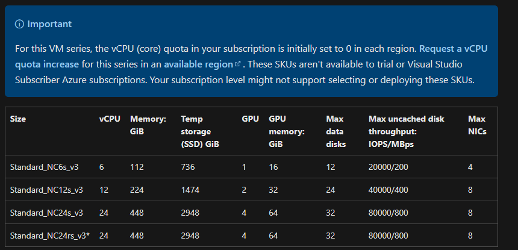

# ONNX Runtime energy consumption

UNDER DEVELOPMENT

- [x] Create ONNX Runtime endpoint
- [ ] Run on GPU
- [] Deploy with whisper large
- [] Create PyTorch endpoint
- [x] Figure out how to measure energy consumption per endpoint with AML
- [] Compare the two

## Cloud experimentation

### Dependencies

See [env.yml](env.yml)

### Compute


### Model

Try whisper large

### Endpoint


```bash
https://whisper-onnx.australiaeast.inference.ml.azure.com/score
```

### Metrics

Go to endpoint in AML

Click on metrics

Add metric GPU energy in Joules

### Inference script

### Call scoring endpoint

curl -i -X POST host:port/post-file -H "Content-Type: text/xml" --data-binary "@path/to/file"

### Measurement tools


## Local experimentation

### Setup

```bash
pip install onnx
pip install transformers
pip install torch (or GPU version)
pip install onnxruntime-gpu
pip install experiment-impact-tracker 
```

#### Windows

Install Power Gadget: https://www.intel.com/content/www/us/en/developer/articles/tool/power-gadget.html

TODO: find Python package for Power Gadget 

### Export model

```bash
python export.py
```

### Run on Windows

In one terminal

```bash
python create_session.py
```

In another

```bash
"c:\Program Files\Intel\Power Gadget 3.6\PowerLog3.0.exe" -file power.csv -cmd python run_session.py
```

### Run on Mac

```bash
python score.py
```

### Reference

https://www.intel.com/content/www/us/en/developer/articles/tool/power-gadget.html 

https://github.com/Breakend/experiment-impact-tracker

nvidia-smi

nvcc

https://github.com/Syllo/nvtop

https://developer.nvidia.com/nvidia-management-library-nvml 

https://learn.microsoft.com/en-us/azure/machine-learning/how-to-deploy-online-endpoints?view=azureml-api-2&tabs=azure-cli 

https://learn.microsoft.com/en-us/azure/virtual-machines/sizes-gpu 

https://learn.microsoft.com/en-us/azure/virtual-machines/ncv3-series

